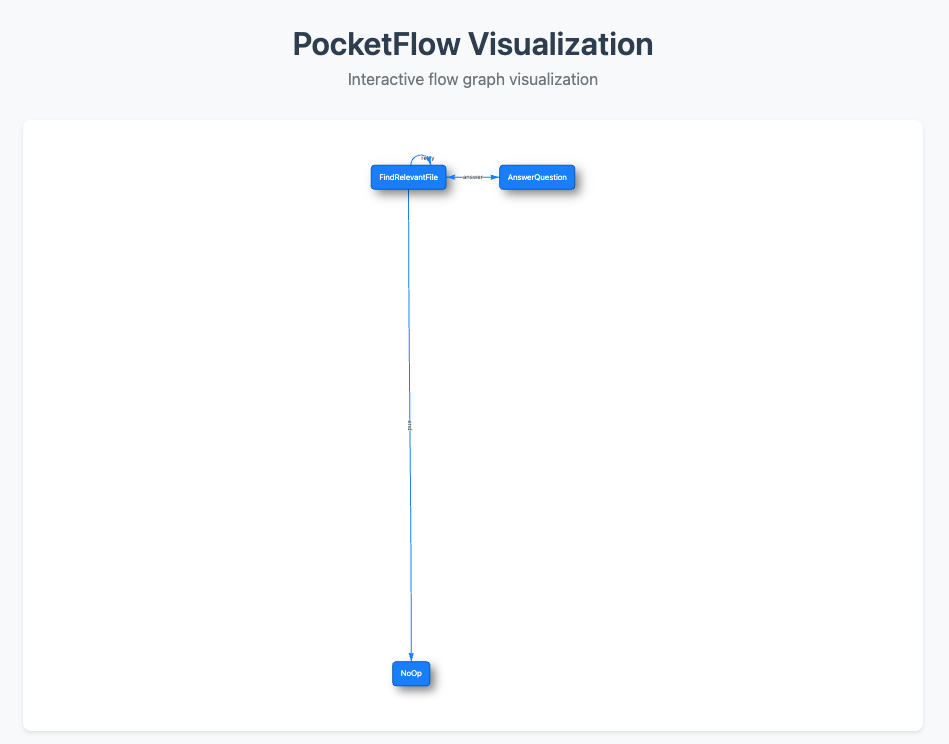

# PocketFlow.js Viz

Helper for `@pocketflow/core` to visualize the workflow.

## Installation

```bash
npm install @pocketflow/viz
```

## Usage

```ts
import { visualize } from '@pocketflow/viz';
import { Flow, Node } from '@pocketflow/core';

class Node1 extends Node {
  async exec(shared: any): Promise<any> {
    return shared;
  }
}

class Node2 extends Node {
  async exec(shared: any): Promise<any> {
    return shared;
  }
}

const node1 = new Node1();
const node2 = new Node2();
node1.connect(node2);

(async () => {
  await visualize(new Flow(node1));
})();
```

For the example below, refer to the code from [essay.ts](./packages/examples/src/essay.ts).


